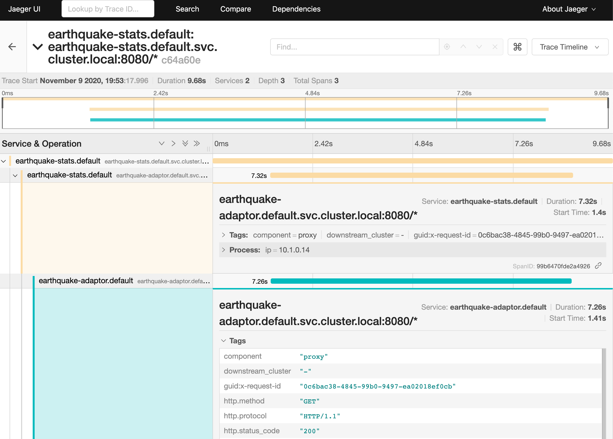

# Earthquake API - Distributed tracing demo with Istio and ktor-header-forwarding

Demo application consisting of two Ktor microservices instrumented with [ktor-header-forwarding](https://github.com/fstien/ktor-header-forwarding), illustrating the use of distributed tracing features of [Istio](https://istio.io/latest/docs/tasks/observability/distributed-tracing/overview/) in a local Kubernetes cluster.

* EarthquakeAdaptor retrieves data about earthquakes that happened today using an [API from the U.S. Geological Survey](https://earthquake.usgs.gov/fdsnws/event/1/).
* EarthquakeStats calls EarthquakeStats and exposes statistics about today's earthquakes such as `GET /earthquakes/latest` or `GET /earthquakes/biggest`. 

## Requirements
This demo assumes that you have the following installed on your local machine. 
- [Docker Desktop](https://www.docker.com/products/docker-desktop) (or some other local Kubernetes installation)
- [Istioctl](https://istio.io/latest/docs/ops/diagnostic-tools/istioctl/)

## Running
1. Build docker images for both services. This can take some time if you do not have the base images cached. 
        
        docker build -f docker/Dockerfile.EarthquakeStats -t earthquake-stats .
        docker build -f docker/Dockerfile.EarthquakeAdaptor -t earthquake-adaptor .

2. Configure the default namespace to have istio sidecar proxy injection enabled. 
        
        kubectl apply -f k8s/namespaces.yaml

3. Install Istio onto the cluter with the demo config (which includes a Jaeger instance).
        
        istioctl manifest apply --set profile=demo

4. Release the two docker containers to the cluster.
        
        kubectl apply -f k8s/earthquake-adaptor.yaml
        kubectl apply -f k8s/earthquake-stats.yaml

5. Check that both pods are running. 
        
        kubectl get po

6. Send some traffic to the `earthquake-stats` pod. 
        
        curl localhost:30101/earthquake/latest

7. Open the Jaeger UI to view traces.
        
        istioctl dashboard jaeger

## Steps 

1. Import [ktor-header-forwarding](https://github.com/fstien/ktor-header-forwarding) in the `build.gradle` of the `earthquake-stats` application. [Commit](https://github.com/fstien/ktor-istio-distributed-tracing-demo/commit/cef896a43e88f6cf0248252df20483b2e839526a).

        implementation "com.github.fstien:ktor-header-forwarding:0.1.0"

2. Install the `HeaderForwardingServer` Ktor feature onto the application call pipeline, configured to forward requests as described in the [Istio distributed tracing documentation](https://istio.io/latest/docs/tasks/observability/distributed-tracing/overview/). [Commit](https://github.com/fstien/ktor-istio-distributed-tracing-demo/commit/bd155f452bc8aca48dbb5e466b3904c40e68a217).

        install(HeaderForwardingServer) {
           header("x-request-id")
           header("x-ot-span-context")
           filter { header -> header.startsWith("x-b3-") }
        }

3. Install the `HeaderForwardingClient` Ktor feature onto the http client. [Commit](https://github.com/fstien/ktor-istio-distributed-tracing-demo/commit/0e647fafc3273ff4a933461fcdb2f0375a537456).

        install(HeaderForwardingClient)

   We do not need to instrument `earthquake-adaptor` as it does not make any requests within the cluster. 
